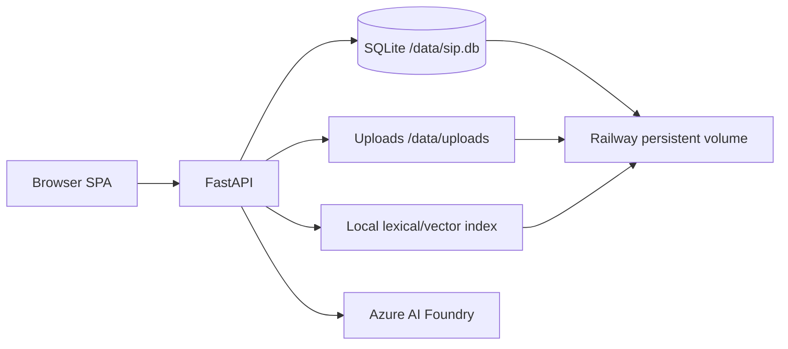

# SIP — Solution Intelligence Platform

SIP is a multilingual proof of concept for ibc group / ETIL. Sales and product users build a structured Business Context through a guided conversation, work with private documents, browse approved portfolio items, and ask a grounded knowledge assistant questions.

| | |
|---|---|
| Live | https://sip-poc-production.up.railway.app — deployment `913039a5`, running |
| Stack | Python 3.13, FastAPI, vanilla JavaScript, SQLite, Azure AI Foundry |
| Languages | English, Nederlands, Deutsch |
| Hosting | Railway project and service `sip-poc`, persistent volume mounted at `/data` |

## Current experience

The home screen presents a central prompt composer with conversation history directly underneath. Starting or opening a conversation switches to a full-workspace chat while retaining the product navigation. Translucent “Liquid Glass” materials are used selectively on the launcher and chat controls, with high-contrast and reduced-motion fallbacks.

There are two persistent conversation types:

- `context`: guided Business Context intake, document proposals, review and approval.
- `knowledge`: organisation knowledge chat with saved message history and source visibility.

Conversations and draft contexts belong to one user. Other users receive `404` for private object IDs. Approved contexts and explicitly published evidence are organisation-wide; administrators can inspect all records. Legacy rows are assigned to the configured bootstrap account during the idempotent startup migration and are never implicitly public.

## Documents and retrieval

PDF and DOCX uploads are supported. Files are limited to 10 MB and PDFs to 200 pages. Workspace documents remain private to their owner. Context evidence also remains private until the related Business Context is approved and the reviewer leaves that document selected for publication.

For context evidence, the model proposes structured field values with document provenance. The user can edit, accept or ignore each proposal; accepted values are merged into the review form and are only saved with the context. Assumptions and open questions are never auto-applied.

The knowledge assistant uses hybrid lexical/vector retrieval when an embedding index is available and falls back to lexical retrieval otherwise. Visibility is filtered before ranking. Reciprocal-rank-fusion results below `SIP_RELEVANCE_THRESHOLD` do not ground an answer. In that case the UI shows near matches and lets the user explicitly request a general, uncited answer. Knowledge follow-ups are reconstructed from stored messages instead of relying on provider-side response IDs.

The bundled `knowledge/markdown` corpus is a reviewed snapshot of public ETIL and ibc group pages. Uploads are indexed incrementally and removed from the index when deleted.

## Architecture



The frontend is plain JavaScript and CSS with no build step. FastAPI serves the UI, API and public `/health` endpoint. SQLite, uploads and the vector index live on the same persistent volume, so production must remain a single replica until storage is moved to shared services.

## Repository

```text
backend/app/
  main.py       routes, auth, chat orchestration and migrations
  store.py      SQLite persistence and ownership rules
  retrieval.py hybrid retrieval, visibility filtering and diagnostics
  uploads.py    upload validation and PDF/DOCX extraction
  app.js        single-page application
  styles.css    responsive UI and glass materials
knowledge/      bundled source corpus
tests/          ownership/workspace regression tests
Dockerfile      production image
railway.json    Railway build, healthcheck and restart policy
```

## Main API

| Area | Endpoints |
|---|---|
| Authentication | `POST /api/auth/login`, `POST /api/auth/logout`, `GET /api/auth/me` |
| Users | `GET/POST /api/users`, `PUT/DELETE /api/users/{id}` |
| Conversations | `GET/POST /api/conversations`, `GET/DELETE /api/conversations/{id}`, message and portfolio routes |
| Contexts | `GET/POST /api/contexts`, `GET/PUT/DELETE /api/contexts/{id}`, `POST /api/contexts/prepare` |
| Uploads | `GET/POST /api/uploads`, `GET/DELETE /api/uploads/{id}`, `POST /api/uploads/{id}/proposals` |
| Knowledge | `POST /api/knowledge/chat` |
| Portfolio | `/api/portfolio/solutions`, `/api/portfolio/sources` and source detail |
| Operations | public `GET /health` |

FastAPI documentation is available at `/docs` after login.

## Configuration

Copy `.env.example` to `.env`; never commit real secrets.

| Variable | Purpose |
|---|---|
| `AZURE_AI_PROJECT_ENDPOINT`, `AZURE_AI_API_KEY` | Azure AI Foundry connection |
| `MODEL_DEPLOYMENT` | Chat model deployment, default `gpt-5-mini` |
| `EMBEDDING_DEPLOYMENT` | Embedding deployment for hybrid retrieval |
| `SIP_DB_PATH` | SQLite path; production uses `/data/sip.db` |
| `SIP_UPLOAD_ROOT` | Upload directory; defaults beside the database |
| `SIP_VECTOR_PATH` | Persistent vector index path |
| `SIP_RETRIEVAL` | `lexical` or `hybrid` |
| `SIP_RELEVANCE_THRESHOLD` | Minimum fused relevance score, default `0.017` |
| `SIP_AUTH_EMAIL`, `SIP_AUTH_PASSWORD`, `SIP_AUTH_ROLE` | Bootstrap account |
| `SIP_AUTH_EXTRA_USERS` | JSON map of additional demo accounts |
| `SIP_SESSION_SECRET`, `SIP_COOKIE_SECURE` | Signed cookie configuration |
| `PORT` | HTTP port; Railway injects this value |

## Local development

```powershell
python -m venv .venv
.venv\Scripts\Activate.ps1
pip install -r backend/requirements.txt
Copy-Item .env.example .env
Set-Location backend
uvicorn app.main:app --reload --port 8000
```

Run the checks from the repository root:

```powershell
$env:PYTHONPATH='backend'
python -m pytest tests -q
node --check backend/app/app.js
```

## Deployment

The production service currently receives explicit CLI deployments from this repository. GitHub is the source of truth, but Railway is not configured for automatic deploy-on-push.

```powershell
railway link --project e0e06291-87e2-4b51-b83d-392ae919f448
railway up --service sip-poc --detach
```

`railway.json` declares the Dockerfile build, `/health` deployment healthcheck and restart-on-failure policy for a future source-connected deployment. The current CLI-uploaded service is healthy, but Railway does not apply the file-level healthcheck to this deployment method. The image starts through a JSON-form command so signals reach the Python process correctly.

## Known limitations

- SQLite and the local index require a single application replica.
- Scanned/image-only PDFs are not OCR'd.
- Ignored document proposals are not yet persisted across a page reload, so the model may propose them again later.
- Proposal edits remain client-side until the Business Context is saved.
- Upload/index mutation is intended for POC traffic; it does not yet use distributed locking.
- Demo environment credentials and user lifecycle need hardening before customer production use.
- The public `/health` endpoint returns OK, but the current CLI-uploaded Railway service has no platform healthcheck configured; set it in Railway or connect the GitHub source so `railway.json` is applied.

Last documentation review: **16 September 2026**.
