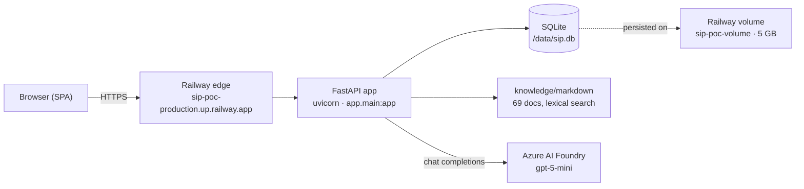

# SIP — Solution Intelligence Platform (Proof of Concept)

A FastAPI + vanilla-JS web application running on Railway. Sales and product people use it to
build a **Business Context** through a guided conversation, browse the **ibc group / ETIL
portfolio** of services and solutions, and ask a **multilingual knowledge assistant** grounded
in a snapshot of both companies' public website content.

| | |
|---|---|
| **Live** | https://sip-poc-production.up.railway.app |
| **Status** | `SUCCESS` / `RUNNING` — deployment `19703fe0`, 11 Sep 2026 07:13 UTC |
| **Stack** | Python 3.13 · FastAPI 0.141 · Uvicorn · SQLite · Azure AI Foundry (`gpt-5-mini`) |
| **Host** | Railway — project `sip-poc`, single `production` environment, single service |
| **Languages** | English, Nederlands, Deutsch |

> [!NOTE]
> The application source in this repo was **extracted from the running container** (`railway ssh`),
> because no Git source was ever connected to the Railway service. `backend/` and `knowledge/`
> are byte-for-byte what production runs. The `Dockerfile` and `.dockerignore` are **reconstructed**
> — they are not in the image — from the build logs and the container's actual start command.
> Verify them against your local working copy before relying on them for a deploy.

---

## Architecture



One container plus one attached volume. No separate database service, no queue, no cache, no
object storage, no vector store — retrieval is local lexical scoring over markdown files baked
into the image.

---

## Repository structure

```
.
├── Dockerfile                             # reconstructed — see note above
├── .dockerignore                          # reconstructed
├── .env.example
├── backend/
│   ├── requirements.txt
│   └── app/
│       ├── __init__.py
│       ├── main.py                        # 28 KB — FastAPI app, all routes, auth middleware
│       ├── models.py                      # 4 KB  — Pydantic request/response models
│       ├── store.py                       # 16 KB — SQLite access + password hashing
│       ├── knowledge.py                   # 15 KB — markdown loading, lexical retrieval, grounding
│       ├── system_prompt.txt              # Business Context builder prompt
│       ├── finalizer_prompt.txt           # Context finalisation prompt
│       ├── knowledge_assistant_prompt.txt # "Ask ibc group" prompt
│       ├── index.html                     # SPA shell (25 KB)
│       ├── login.html                     # Login page
│       ├── app.js                         # 35 KB — the entire SPA, no framework, no build step
│       ├── i18n.js                        # 33 KB — en / nl / de translation table
│       ├── styles.css                     # 18 KB — dark theme, orange accent (#ff7a30)
│       └── *.png, login-hero.jpg          # ETIL and ibc group branding
└── knowledge/
    ├── README.md
    └── markdown/
        ├── etil/                          # 32 docs — expertises, solutions, company pages
        └── ibc-group/                     # 37 docs — services, cases, company pages
```

At runtime the image lays this out as `/workspace/backend` (the working directory) and
`/workspace/knowledge`, with the Railway volume mounted at `/data`.

### Knowledge base

`knowledge/markdown/` is a reviewed snapshot of public ETIL and ibc group website content,
retrieved 10 September 2026. Every document carries YAML front matter with `source_url`,
`canonical_url`, `source_organisation`, `source_language`, `page_type`, `source_last_modified`,
`retrieved_at`, a `content_hash` and the `extraction_method`.

Retrieval (`knowledge.py`) is deliberately local and deterministic: tokenisation with a
stopword list and token aliases, lexical scoring, and excerpt construction. The knowledge
README states the intent to replace this with Azure AI Search before an Azure deployment,
keeping the API response contract and source metadata unchanged.

### Frontend

A single-page app in plain JavaScript — no framework, no bundler, no build step. It switches
between five views via `showView()`:

| View | What it does |
|---|---|
| `conversations` | Saved Business Contexts — resume one or start new |
| `builder` | The guided intake conversation |
| `review` | Review and approve a generated context |
| `portfolio` | Filterable table of solutions and website sources |
| `source` | Detail view of one portfolio source |

Navigation in `i18n.js` also lists **Ask ibc group** (knowledge chat), **Integrations**,
**Lead intelligence**, **Marketing studio**, **Team** and **Administration** — the middle
three carry only a `kicker` and `copy` string, so they are placeholders.

`app.js`, `i18n.js`, `styles.css` and the images are served **unauthenticated**; only `/api`
is gated.

---

## API

`main.py` defines every route. An HTTP middleware (`require_login`) enforces the session
cookie and per-role authorisation (`_role_allows`); unauthenticated requests get `303 See Other`
to `/login`. FastAPI's `/docs` and `/openapi.json` are gated the same way.

### Auth

| Method | Path |
|---|---|
| `GET` | `/login` |
| `POST` | `/api/auth/login` |
| `POST` | `/api/auth/logout` |
| `GET` | `/api/auth/me` |

### Users

| Method | Path |
|---|---|
| `GET` `POST` | `/api/users` |
| `PUT` `DELETE` | `/api/users/{user_id}` |

Roles: `admin`, `product_owner`, `sales` — enforced server-side and mirrored in the client by
`applyRolePermissions()`.

### Conversations

| Method | Path |
|---|---|
| `GET` `POST` | `/api/conversations` |
| `GET` `DELETE` | `/api/conversations/{conversation_id}` |
| `POST` | `/api/conversations/{conversation_id}/messages` |
| `POST` | `/api/conversations/{conversation_id}/portfolio` |

### Business Contexts

| Method | Path |
|---|---|
| `GET` `POST` | `/api/contexts` |
| `GET` `PUT` `DELETE` | `/api/contexts/{context_id}` |
| `POST` | `/api/contexts/prepare` |

### Portfolio

| Method | Path |
|---|---|
| `GET` | `/api/portfolio/solutions` |
| `GET` | `/api/portfolio/sources` |
| `GET` | `/api/portfolio/sources/{source_id}` |

Source IDs are namespaced by organisation, e.g. `ibc-group:service-expert-staffing`,
`etil:solution-vestigingen-vastgoedregister-limburg-vvl`.

### Chat

| Method | Path |
|---|---|
| `POST` | `/api/chat` |
| `POST` | `/api/knowledge/chat` |

### Static and operational

`/`, `/app.js`, `/i18n.js`, `/styles.css`, `/ibc-group-lockup.png`, `/login-hero.jpg`, and
`GET /health` (public, returns `{"status":"ok"}`).

---

## Data

SQLite at `/data/sip.db` on the Railway volume `sip-poc-volume` (~84 MB of 5000 MB used).
`store.py` creates the schema on startup:

| Table | Notable columns |
|---|---|
| `business_contexts` | `id`, `status` (`draft` \| `approved`), `content`, timestamps |
| `conversations` | `id`, `title`, `is_ready_to_save`, `readiness_reason`, `portfolio_context_id`, `language` (added by migration, default `en`), timestamps |
| `conversation_messages` | `id`, `conversation_id` → `conversations(id)`, `role` (`user` \| `assistant`), `content`; indexed on `(conversation_id, id)` |
| `users` | `id`, `email` (unique), `password_hash`, `salt`, `role` (`admin` \| `product_owner` \| `sales`), timestamps |

Passwords are salted and hashed in `store.py` (`_hash_password` / `verify_password`) —
constant-time comparison via `hmac`.

Because state is a file on a single volume, the service **cannot scale beyond one replica** as
built. `numReplicas` is 1, region `us-west2`.

---

## Configuration

All configuration comes from environment variables, loaded with `python-dotenv` locally and
injected by Railway in production. **No values are stored in this repo** — see
[`.env.example`](.env.example).

| Variable | Purpose |
|---|---|
| `AZURE_AI_PROJECT_ENDPOINT` | Azure AI Foundry project endpoint |
| `AZURE_AI_API_KEY` | Foundry API key (falls back to `DefaultAzureCredential`) |
| `AZURE_TENANT_ID` / `AZURE_CLIENT_ID` / `AZURE_CLIENT_SECRET` | Service principal for Azure auth |
| `MODEL_DEPLOYMENT` | Model deployment name — currently `gpt-5-mini` |
| `SIP_DB_PATH` | SQLite path — `/data/sip.db` in production |
| `SIP_AUTH_EMAIL` / `SIP_AUTH_PASSWORD` | Primary bootstrap account |
| `SIP_AUTH_ROLE` | Role for that account, default `admin` |
| `SIP_AUTH_EXTRA_USERS` | JSON map of additional accounts to passwords |
| `SIP_SESSION_SECRET` | HMAC secret for session cookies |
| `SIP_COOKIE_SECURE` | `true` in production, `false` for local HTTP |
| `PORT` | Injected by Railway (`8080`); falls back to `8000` |

---

## Running locally

```bash
python -m venv .venv && .venv\Scripts\activate
```

```bash
pip install -r backend/requirements.txt
```

```bash
copy .env.example .env
```

Fill in `.env`, then from the `backend/` directory:

```bash
uvicorn app.main:app --reload --port 8000
```

`knowledge.py` resolves the corpus as `<backend/app>/../../knowledge/markdown`, so the
`backend/` + `knowledge/` layout must be preserved.

---

## Railway infrastructure

| Resource | Value |
|---|---|
| Project | `sip-poc` — `e0e06291-87e2-4b51-b83d-392ae919f448` |
| Workspace | arryaetil's Projects |
| Environment | `production` — `72e55d38-e54c-4671-b4d3-eb135277771b` |
| Service | `sip-poc` — `bf38c6a3-3e71-42cc-ba91-7f552f8a40f1` |
| Volume | `sip-poc-volume` — `ee8c6df4-7c45-4228-91aa-17498ee48b2f`, 5 GB at `/data` |
| Public domain | `sip-poc-production.up.railway.app` (Railway-provided, no custom domain) |
| Private domain | `sip-poc.railway.internal` |
| Buckets / functions / cron | none |

### Service manifest

| Setting | Value |
|---|---|
| Builder | `DOCKERFILE` (`/Dockerfile`), build environment V3 |
| Runtime | V2 |
| Region / replicas | `us-west2`, 1 replica |
| Restart policy | `ON_FAILURE`, max 10 retries |
| Healthcheck | **not configured** — even though `/health` exists |
| Start command | none — uses the image `CMD` |
| Sleep application | disabled |
| Limits | 8 vCPU / 8 GB ceiling |

Runtime is essentially idle: CPU ~0.003 vCPU, memory ~122 MB of 8192 MB (1.5 %).

---

## Deployment

Deploys are made from a local working copy with the Railway CLI — **no Git source is connected
to the service** (`source: null`). All 20 recorded deployments were made through `railway up`
driven by an AI coding agent (`cliCaller: skill:use-railway`).

```bash
railway link --project e0e06291-87e2-4b51-b83d-392ae919f448
```

```bash
railway up
```

### Recent history

| Date (UTC) | ID | Message |
|---|---|---|
| 2026-09-11 07:13 | `19703fe0` | Improve multilingual knowledge retrieval — **live** |
| 2026-09-11 07:09 | `0fd0f4c6` | Make knowledge chat conversational and multilingual |
| 2026-09-11 07:01 | `ba61de51` | Unify portfolio and add knowledge assistant |
| 2026-09-10 20:21 | `c730c7ac` | Visualize Solutions and Website Sources |
| 2026-09-10 20:01 | `c4656ec2` | Integrate Solutions and Website Sources portfolio API |
| 2026-09-07 10:37 | `c25fe824` | Allow multiple SIP demonstration accounts |
| 2026-08-31 18:43 | `f1ab06f3` | Enable Foundry chat on Railway |

---

## Known gaps

1. **Nothing connects this repo to the deployment yet.** Point the Railway service at this
   repo so pushes deploy and the code stops living only in a container.
2. **Weak demo credentials.** `SIP_AUTH_PASSWORD` is 7 characters, and `SIP_AUTH_EXTRA_USERS`
   holds per-user passwords in plaintext in the environment. Fine for a POC behind an unlisted
   URL; not fine once it is demoed to customers. Database users are properly salted and hashed.
3. **No healthcheck configured.** `/health` works — wiring it into the service settings means a
   broken build never takes over live traffic.
4. **Single replica by construction.** SQLite on a volume rules out horizontal scaling. Moving
   to Postgres is the unlock if this becomes real.
5. **`CMD` in shell form.** The build raises `JSONArgsRecommended`: SIGTERM is not forwarded to
   uvicorn, so redeploys shut down ungracefully.
6. **Frontend bundle is public.** `app.js` and `i18n.js` are served unauthenticated, exposing
   the full API surface, role model and UI copy to anyone with the URL.
7. **Retrieval is a placeholder.** `knowledge/README.md` calls for replacing local lexical
   search with Azure AI Search before an Azure deployment.

---

## How this repo was assembled

Source extracted from the live container; everything else read from the Railway CLI (v5.8.0):

```bash
railway ssh "cd /workspace && tar -cz backend knowledge | base64 -w0"
```

```bash
railway status --json && railway variables --json && railway deployment list --json
```

```bash
railway logs --build && railway logs --deployment && railway metrics --json
```

Last verified: **15 September 2026**.
