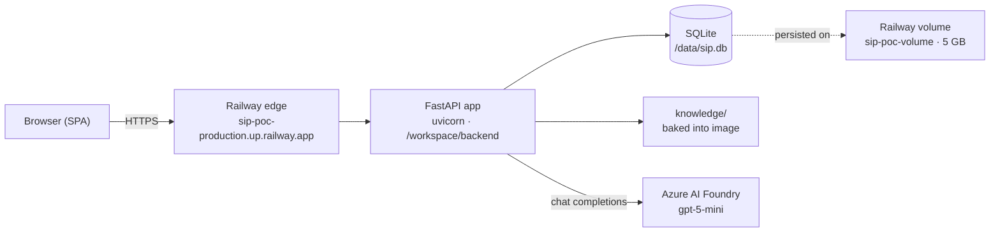

# SIP — Sales Intelligence Platform (Proof of Concept)

A FastAPI + vanilla-JS web application running on Railway. It lets sales and product people
build a **Business Context**, browse the **ibc group / ETIL portfolio** of services and
solutions, and ask a **multilingual knowledge assistant** backed by Azure AI Foundry.

| | |
|---|---|
| **Live** | https://sip-poc-production.up.railway.app |
| **Status** | `SUCCESS` / `RUNNING` — deployment `19703fe0`, 11 Sep 2026 07:13 UTC |
| **Stack** | Python 3.13 · FastAPI · Uvicorn · SQLite · Azure AI Foundry (`gpt-5-mini`) |
| **Host** | Railway — project `sip-poc`, single `production` environment, single service |
| **Languages** | English, Nederlands, Deutsch |

> [!IMPORTANT]
> **The application source code is not in this repository yet.** This repo currently
> documents the *deployed* system. Everything below was reconstructed from the Railway CLI
> (build logs, request logs, service manifest, environment variables) and from the publicly
> served frontend bundle. See [Getting the source in here](#getting-the-source-in-here).

---

## Architecture



One container plus one attached volume. There is no separate database service, no queue, no
cache and no object storage — the whole POC is a single service.

---

## Structure

The Dockerfile build stages reveal the repository layout the image is built from:

```
.
├── Dockerfile                    # python:3.13-slim base, 7 stages, CMD in shell form
├── .dockerignore
├── backend/
│   ├── requirements.txt          # pip install --no-cache-dir
│   └── app/                      # FastAPI application  <- WORKDIR is /workspace/backend
│       └── ...                   # routers, models, static assets (app.js, i18n.js, styles.css)
└── knowledge/                    # knowledge base content, baked into the image
```

Inside the container:

| Path | Contents |
|---|---|
| `/workspace` | build root |
| `/workspace/backend` | working directory at runtime |
| `/workspace/backend/app` | application package |
| `/workspace/knowledge` | knowledge corpus |
| `/data` | **mounted volume** — holds `sip.db`, survives redeploys |

### Frontend

A server-rendered login page plus a single-page app served as three static files. All three
are served **without authentication** — only the API is gated:

| Asset | Size | Purpose |
|---|---|---|
| `app.js` | ~35 KB | The entire SPA — no framework, no build step |
| `i18n.js` | ~33 KB | Translation table for `en` / `nl` / `de` |
| `styles.css` | ~18 KB | Dark theme, orange accent (`#ff7a30`) |
| `login-hero.jpg`, `ibc-group-lockup.png` | — | Branding |

The SPA switches between five views via `showView()`:

| View | What it does |
|---|---|
| `conversations` | List of saved Business Contexts — resume one or start new |
| `builder` | Create/edit a context (the intake form) |
| `review` | Review a generated context |
| `portfolio` | Filterable table of solutions and website sources |
| `source` | Detail view of one portfolio source |

Navigation sections in `i18n.js` also include **Ask ibc group** (knowledge chat),
**Integrations**, **Lead intelligence**, **Marketing studio**, **Team** and
**Administration** — the last few look like placeholders (they carry only a `kicker` and
`copy` string).

Three roles are referenced in the client and drive `applyRolePermissions()`:
`admin`, `product_owner`, `sales`.

---

## API surface

Observed in production request logs and in the frontend bundle. Everything under `/api`
requires a session cookie; unauthenticated requests get `303 See Other` to `/login`.
FastAPI's `/docs` and `/openapi.json` are gated the same way.

### Auth

| Method | Path |
|---|---|
| `POST` | `/api/auth/login` |
| `POST` | `/api/auth/logout` |
| `GET` | `/api/auth/me` |

### Conversations / Business Contexts

| Method | Path |
|---|---|
| `GET` `POST` | `/api/conversations` |
| `GET` `DELETE` | `/api/conversations/{id}` |
| `POST` | `/api/conversations/{id}/messages` |
| — | `/api/conversations/{id}/portfolio` |
| `GET` `PUT` | `/api/contexts/{id}` |

### Portfolio

| Method | Path |
|---|---|
| `GET` | `/api/portfolio/solutions` |
| `GET` | `/api/portfolio/sources?page_type=service\|solution&limit=100` |
| `GET` | `/api/portfolio/sources/{source_id}` |

Source IDs are namespaced by organisation, for example
`ibc-group:service-expert-staffing`, `ibc-group:service-ai-knowledge-management`,
`etil:solution-vestigingen-vastgoedregister-limburg-vvl`.

### Knowledge assistant

| Method | Path |
|---|---|
| `POST` | `/api/knowledge/chat` |

### Team / users

| Method | Path |
|---|---|
| `GET` | `/api/users` |
| — | `/api/users/{id}` |

### Operational

| Method | Path | Notes |
|---|---|---|
| `GET` | `/health` | Public, returns `{"status":"ok"}` |

---

## Data

SQLite at `/data/sip.db` on the Railway volume `sip-poc-volume`.

- **Used:** ~84 MB of 5000 MB
- **State:** `READY`, mounted at `/data`

Because state lives in a file on a single volume, the service **cannot scale beyond one
replica** as built. `numReplicas` is 1, region `us-west2`.

---

## Configuration

All configuration comes from Railway environment variables. **No values are stored in this
repo** — see [`.env.example`](.env.example) for the shape.

| Variable | Purpose |
|---|---|
| `AZURE_AI_PROJECT_ENDPOINT` | Azure AI Foundry project endpoint |
| `AZURE_AI_API_KEY` | Foundry API key |
| `AZURE_TENANT_ID` / `AZURE_CLIENT_ID` / `AZURE_CLIENT_SECRET` | Service principal for Azure auth |
| `MODEL_DEPLOYMENT` | Model deployment name — currently `gpt-5-mini` |
| `SIP_DB_PATH` | SQLite path — `/data/sip.db` |
| `SIP_AUTH_EMAIL` / `SIP_AUTH_PASSWORD` | Primary demo account |
| `SIP_AUTH_EXTRA_USERS` | JSON map of additional demo accounts to passwords |
| `SIP_SESSION_SECRET` | Session cookie signing secret |
| `SIP_COOKIE_SECURE` | `true` in production |

Railway also injects `RAILWAY_*` variables — project, service and environment IDs, public
and private domains, volume name and mount path.

---

## Railway infrastructure

| Resource | Value |
|---|---|
| Project | `sip-poc` — `e0e06291-87e2-4b51-b83d-392ae919f448` |
| Workspace | arryaetil's Projects |
| Environment | `production` — `72e55d38-e54c-4671-b4d3-eb135277771b` |
| Service | `sip-poc` — `bf38c6a3-3e71-42cc-ba91-7f552f8a40f1` |
| Volume | `sip-poc-volume` — `ee8c6df4-7c45-4228-91aa-17498ee48b2f`, 5 GB at `/data` |
| Public domain | `sip-poc-production.up.railway.app` (Railway-provided, no custom domain) |
| Private domain | `sip-poc.railway.internal` |
| Buckets / functions / cron | none |

### Service manifest

| Setting | Value |
|---|---|
| Builder | `DOCKERFILE` (`/Dockerfile`), build environment V3 |
| Runtime | V2 |
| Region / replicas | `us-west2`, 1 replica |
| Restart policy | `ON_FAILURE`, max 10 retries |
| Healthcheck | **not configured** — even though `/health` exists |
| Start command | none — uses the image `CMD` |
| Sleep application | disabled |
| Limits | 8 vCPU / 8 GB ceiling |

### Runtime characteristics

Essentially idle: CPU ~0.003 vCPU (0.0 % utilisation), memory ~122 MB of 8192 MB (1.5 %).

---

## Deployment

Deploys are made from a local working copy with the Railway CLI — **there is no Git source
connected to the service** (`source: null`). All 20 recorded deployments were made through
`railway up` driven by an AI coding agent (`cliCaller: skill:use-railway`).

```bash
railway link --project e0e06291-87e2-4b51-b83d-392ae919f448
railway up
```

### Recent history

| Date (UTC) | ID | Message |
|---|---|---|
| 2026-09-11 07:13 | `19703fe0` | Improve multilingual knowledge retrieval — **live** |
| 2026-09-11 07:09 | `0fd0f4c6` | Make knowledge chat conversational and multilingual |
| 2026-09-11 07:01 | `ba61de51` | Unify portfolio and add knowledge assistant |
| 2026-09-10 20:21 | `c730c7ac` | Visualize Solutions and Website Sources |
| 2026-09-10 20:01 | `c4656ec2` | Integrate Solutions and Website Sources portfolio API |
| 2026-09-07 10:37 | `c25fe824` | Allow multiple SIP demonstration accounts |
| 2026-08-31 18:43 | `f1ab06f3` | Enable Foundry chat on Railway |

---

## Known gaps

Things worth fixing before this POC is shown more widely or handed to anyone else.

1. **No Git source.** Deploys depend on whoever holds the local working copy. Putting the
   source in this repo and connecting it to the Railway service makes deploys reproducible
   and gives the code a backup.
2. **Weak demo credentials.** `SIP_AUTH_PASSWORD` is 7 characters, and `SIP_AUTH_EXTRA_USERS`
   stores per-user passwords in plaintext in the environment. Acceptable for a POC behind an
   unlisted URL; not acceptable once it is demoed to customers.
3. **No healthcheck configured.** `/health` exists and works — wiring it into the service
   settings means a broken build never takes over live traffic.
4. **Single replica by construction.** SQLite on a volume rules out horizontal scaling. Fine
   for a POC; moving to Postgres is the unlock if this becomes real.
5. **Dockerfile `CMD` uses shell form.** The build raises `JSONArgsRecommended`, so signals
   (SIGTERM on redeploy) are not forwarded to the app and shutdowns are ungraceful.
6. **Frontend bundle is public.** `app.js` and `i18n.js` are served unauthenticated, so the
   full API surface, role model and UI copy are readable by anyone with the URL.

---

## Getting the source in here

The running container holds the only copy reachable from this machine. To extract it:

```bash
ssh-keygen -t ed25519 -C "sip-poc railway access"
```

```bash
railway ssh keys add
```

```bash
railway ssh "tar -cz -C /workspace backend knowledge" > sip-poc-src.tar.gz
```

Registering an SSH key changes your Railway account settings, which is why it has not been
done automatically. Once the source is in, drop it alongside this README, keep `.env` out of
Git (see [`.gitignore`](.gitignore)), and connect the repo to the Railway service so that
pushes deploy.

---

## How this document was produced

Entirely from the Railway CLI (v5.8.0) against the live project, plus unauthenticated
fetches of the public frontend assets:

```bash
railway status --json && railway variables --json && railway deployment list --json
```

```bash
railway logs --build && railway logs --deployment && railway metrics --json
```

Last verified: **15 September 2026**.
