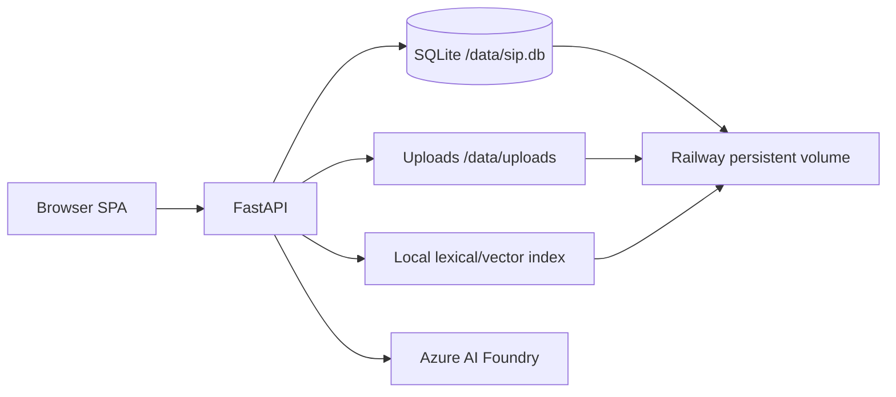
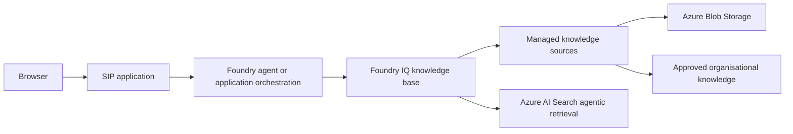

# SIP — Solution Intelligence Platform

SIP is a multilingual proof of concept for ibc group / ETIL. Sales and product users build a structured Business Context through a guided conversation, work with private documents, browse approved portfolio items, and ask a grounded knowledge assistant questions.

| | |
|---|---|
| Live | https://sip-poc-production.up.railway.app — deployment `82552912`, running |
| Stack | Python 3.13, FastAPI, vanilla JavaScript, SQLite, Azure AI Foundry |
| Languages | English, Nederlands, Deutsch |
| Hosting | Railway project and service `sip-poc`, persistent volume mounted at `/data` |
| Target | C#/ASP.NET Core on Azure App Service, Azure SQL, Foundry IQ — see [Agreed direction](#agreed-direction) |

> [!IMPORTANT]
> **Target knowledge architecture: Microsoft Foundry IQ.** The local lexical/vector
> index in this repository is a temporary POC implementation, not the intended
> production architecture. SIP will migrate to a Foundry IQ knowledge base for
> managed, reusable and permission-aware retrieval. Foundry IQ is backed by Azure
> AI Search, so indexing still exists, but SIP will no longer build, store or query
> its own vector index. Do not extend the custom index beyond what is needed to keep
> the POC working. See [MIGRATION.md](MIGRATION.md) and the
> [Azure target architecture](docs/AZURE_TARGET_ARCHITECTURE.md). For the technical
> review, use the concise [minimum Azure resources checklist](docs/AZURE_MINIMUM_RESOURCES.md).

## Agreed direction

Decisions taken with the senior developer on **22 September 2026**. Where this
section conflicts with [MIGRATION.md](MIGRATION.md) or the
[minimum Azure resources checklist](docs/AZURE_MINIMUM_RESOURCES.md), this
section leads: those documents describe the options that were weighed, not the
outcome. The development environment is created by following the
[Azure provisioning runbook](docs/AZURE_PROVISIONING.md).

| Topic | Decision |
|---|---|
| Application | Rewrite in C#/ASP.NET Core. The Python POC stays the behavioural reference and is tagged `poc-python-final`. |
| Source control and CI/CD | Azure DevOps — Azure Repos and Azure Pipelines — replacing GitHub. |
| Hosting | Azure App Service on Linux, publishing compiled .NET output from the pipeline. No container image, so no Dockerfile or container registry. |
| Region | West Europe for every resource. It supports agentic retrieval and the semantic ranker on the AI Search free tier; North Europe is closed to new search services. |
| Database | Azure SQL with EF Core and a Unit of Work layer. |
| Schema migrations | Run in the deploy stage of the pipeline, never on application startup. |
| Retrieval | Foundry IQ on Azure AI Search — free tier for development, Basic before production. |
| Identity | A system-assigned managed identity per web app, so each environment has its own. No API keys, no client secrets, no passwords in connection strings. |
| Deploy cadence | At most two deploys per day, behind a manual approval on the `sip-dev` environment. |

### Branching model

`main` is the starting point of every branch and the only source that is
deployed; nothing is committed to it directly. Each feature gets its own
`feature/<name>` branch. When several features are ready they are first merged
into `integration/<date>`, where conflicts are resolved, and that branch reaches
main as a single merge. The integration branch is recreated from main for every
batch and discarded afterwards, so it cannot drift away from main.

That single merge is also the deploy moment, which is how several features fit
inside the two-deploy budget.

### Identity model

Three identities, none of which stores a password or key:

| Identity | Used for | Mechanism |
|---|---|---|
| `app-sip-<env>-weu` | the running application | system-assigned managed identity |
| Pipeline service connection | building and deploying | workload identity federation |
| The developer's own account | inspecting and debugging | Entra sign-in |

Each web app has its own system-assigned identity, which is also what separates
the environments. A managed identity carries no permissions; every resource keeps
its own list of who may do what. The development identity is never on a
production resource's list, so a call from development to production is refused
with `403`. Nothing has to be blocked, because nothing was ever allowed — and
that is why an endpoint address in the wrong configuration file is a mistake
rather than an incident.

A user-assigned identity would be preferable once more than one component needs
the same rights, such as a background worker or a staging slot. With one web app
per environment there is nothing to share, and a system-assigned identity avoids
both the extra resource and the client ID that would have to be configured.

Roles are assigned on the resource itself rather than on the resource group, so
each grant stays as narrow as it needs to be, and one resource group per
environment keeps a careless assignment from crossing the boundary. Application
and pipeline have deliberately separate rights: the pipeline may deploy but
reaches no data, and the application reaches data but cannot deploy.

Azure SQL has no RBAC roles for data, so both identities become contained
database users — `db_datareader` and `db_datawriter` for the application, and
additionally `db_ddladmin` for the pipeline identity that runs migrations.
Neither is `db_owner`.

### Schema changes

Because migrations run during deployment, a rollback is no longer free: it means
redeploying the previous build, and that older code has to work against the newer
schema. Schema changes therefore follow expand and contract — add the new column,
deploy the code that uses it, and remove the old one only in a later deploy.
Nothing is dropped or renamed in the same deploy as the code change that makes it
obsolete.

Development runs on a B1 plan, where rolling back means redeploying the previous
build. Production gets its own plan, sized for its load rather than for staging
slots: slots require Standard or higher and Linux plans no longer offer Standard,
so swap-based deployment starts at Premium and is a later decision, not a
prerequisite.

### Resource naming

Pattern `<type>-sip-<environment>-weu`. Storage account names omit the hyphens
because Azure does not allow them there.

`rg-sip-dev-weu`, `log-sip-dev-weu`, `appi-sip-dev-weu`, `stsipdevweu`,
`kv-sip-dev-weu`, `srch-sip-dev-weu`, `plan-sip-dev-weu`, `app-sip-dev-weu`.

Production repeats the set with `prod`, in its own resource group. Development
and production each keep their own database, storage account, key vault and
identity; a later test environment may share the development App Service plan
and Log Analytics workspace, but never a database or a storage account.

### Where the application is tested

Azure is the test environment. Compilation and unit tests run locally; anything
that talks to Foundry, AI Search, Blob Storage or the database is verified in
Azure. Azurite and a local database exist to keep work possible offline, not to
substitute for that verification. Debugging happens through Application Insights
rather than a debugger, so structured logging — in particular of what is
actually sent to the model — is a requirement rather than a nicety.

## Engineering status

SIP is a functional proof of concept, not yet a production-ready system. The
current architecture is intentionally small: one FastAPI application, one
browser client, SQLite, local files and a local retrieval index. This keeps the
product understandable while the workflows are validated.

The engineering review of 21 September 2026 identified three blockers that must
be resolved before the Azure production migration:

1. **Ground the Knowledge Assistant correctly.** Retrieval currently selects
   sources and constructs a grounded input, but the model call still receives
   the original question instead of that grounded input. Citations must only be
   returned for evidence that was actually supplied to the model.
2. **Complete the evidence lifecycle.** Approved evidence can become
   organisation-wide, but returning a context to draft, deselecting evidence or
   deleting the context does not yet make that evidence private or remove it.
3. **Fail closed outside local development.** When `SIP_SESSION_SECRET` is
   absent, authentication is disabled and requests receive local-admin access.
   A hosted environment must refuse to start with incomplete authentication
   configuration.

The next implementation work should fix these boundaries and add regression
tests before introducing new infrastructure or rewriting application code.

## Current experience

Both Create context and Ask ibc group open on a central prompt composer with their own conversation history directly underneath. Create context asks which Business Context the user wants to create; Ask ibc group asks what the user wants to work on. Starting or opening either type switches immediately to a full-workspace chat while the response loads. The context chat omits the redundant page header, subtitle and disabled save action; Save to portfolio only appears with the readiness state once the context can actually be prepared. New assistant answers reveal progressively with a short typing cursor; restored history renders immediately and reduced-motion disables the effect. Context intake handles greetings and corrections naturally, does not expose missing-field pressure until the context is ready, and never treats the bundled website corpus as user-uploaded evidence. Translucent “Liquid Glass” materials are used selectively on the launcher and chat controls, with high-contrast and reduced-motion fallbacks.

There are two persistent conversation types:

- `context`: guided Business Context intake, conversational document analysis, review and approval.
- `knowledge`: organisation knowledge chat with saved message history and source visibility.

Conversations and draft contexts belong to one user. Other users receive `404` for private object IDs. Approved contexts and explicitly published evidence are organisation-wide; administrators can inspect all records. Legacy rows are assigned to the configured bootstrap account during the idempotent startup migration and are never implicitly public.

## Documents and retrieval

PDF and DOCX uploads are supported. Files are limited to 10 MB and PDFs to 200 pages. Workspace documents remain private to their owner. Context evidence also remains private until the related Business Context is approved and the reviewer leaves that document selected for publication.

For context evidence, the model reads the uploaded document as untrusted business evidence and brings the relevant knowledge back into the conversation in its own words. It highlights three to five useful insights, connects them to the emerging Business Context, calls out uncertainty and asks at most one useful follow-up question. There are no proposal cards or Accept/Ignore actions. The resulting discussion is saved in the conversation and informs the final review.

The current POC knowledge assistant uses hybrid lexical/vector retrieval when a local embedding index is available and falls back to lexical retrieval otherwise. Visibility is filtered before ranking. Reciprocal-rank-fusion results below `SIP_RELEVANCE_THRESHOLD` do not ground an answer; the UI shows the closest matches without offering a separate general-answer mode. Knowledge follow-ups are reconstructed from stored messages instead of relying on provider-side response IDs. Enter sends from every chat composer and start screen; Shift+Enter inserts a new line.

The retrieval-to-model connection still has the grounding defect recorded in
[Engineering status](#engineering-status). Until that is fixed and covered by a
boundary test, visible source links must not be treated as proof that an answer
was generated from those sources.

The bundled `knowledge/markdown` corpus is a reviewed snapshot of public ETIL and ibc group pages. Uploads are indexed incrementally and removed from the index when deleted.

## Architecture



The frontend is plain JavaScript and CSS with no build step. FastAPI serves the UI, API and public `/health` endpoint. SQLite, uploads and the vector index live on the same persistent volume, so production must remain a single replica until storage is moved to shared services.

### Target Azure knowledge architecture



Foundry IQ becomes the reusable knowledge layer for SIP. It owns knowledge-source
ingestion and retrieval through Azure AI Search. The application continues to own
the Business Context workflow, approvals and presentation. The existing
`retrieve()` boundary should be preserved until the Foundry IQ integration is
validated, so the POC can migrate without rewriting the chat workflows.

## Repository

```text
backend/app/
  main.py       routes, auth, chat orchestration and migrations
  store.py      SQLite persistence and ownership rules
  retrieval.py hybrid retrieval, visibility filtering and diagnostics
  uploads.py    upload validation and PDF/DOCX extraction
  app.js        single-page application
  styles.css    responsive UI and glass materials
knowledge/      bundled source corpus
tests/          ownership/workspace regression tests
docs/           Azure target architecture and minimum-resource checklist
Dockerfile      production image
railway.json    Railway build, healthcheck and restart policy
```

## Main API

| Area | Endpoints |
|---|---|
| Authentication | `POST /api/auth/login`, `POST /api/auth/logout`, `GET /api/auth/me` |
| Users | `GET/POST /api/users`, `PUT/DELETE /api/users/{id}` |
| Conversations | `GET/POST /api/conversations`, `GET/DELETE /api/conversations/{id}`, message and portfolio routes |
| Contexts | `GET/POST /api/contexts`, `GET/PUT/DELETE /api/contexts/{id}`, `POST /api/contexts/prepare` |
| Uploads | `GET/POST /api/uploads`, `GET/DELETE /api/uploads/{id}`, `POST /api/uploads/{id}/discuss` |
| Knowledge | `POST /api/knowledge/chat` |
| Portfolio | `/api/portfolio/solutions`, `/api/portfolio/sources` and source detail |
| Operations | public `GET /health` |

FastAPI documentation is available at `/docs` after login.

## Configuration

Copy `.env.example` to `.env`; never commit real secrets.

| Variable | Purpose |
|---|---|
| `AZURE_AI_PROJECT_ENDPOINT`, `AZURE_AI_API_KEY` | Azure AI Foundry connection |
| `MODEL_DEPLOYMENT` | Chat model deployment, default `gpt-5-mini` |
| `EMBEDDING_DEPLOYMENT` | Embedding deployment for hybrid retrieval |
| `SIP_DB_PATH` | SQLite path; production uses `/data/sip.db` |
| `SIP_UPLOAD_ROOT` | Upload directory; defaults beside the database |
| `SIP_VECTOR_PATH` | Persistent vector index path |
| `SIP_RETRIEVAL` | `lexical` or `hybrid` |
| `SIP_RELEVANCE_THRESHOLD` | Minimum fused relevance score, default `0.017` |
| `SIP_AUTH_EMAIL`, `SIP_AUTH_PASSWORD`, `SIP_AUTH_ROLE` | Bootstrap account |
| `SIP_AUTH_EXTRA_USERS` | JSON map of additional demo accounts |
| `SIP_SESSION_SECRET`, `SIP_COOKIE_SECURE` | Signed cookie configuration |
| `PORT` | HTTP port; Railway injects this value |

## Local development

```powershell
python -m venv .venv
.venv\Scripts\Activate.ps1
pip install -r backend/requirements.txt
Copy-Item .env.example .env
Set-Location backend
uvicorn app.main:app --reload --port 8000
```

Run the checks from the repository root:

```powershell
$env:PYTHONPATH='backend'
python -m pytest tests -q
node --check backend/app/app.js
```

## Deployment

The production service currently receives explicit CLI deployments from this repository. GitHub is the source of truth, but Railway is not configured for automatic deploy-on-push.

```powershell
railway link --project e0e06291-87e2-4b51-b83d-392ae919f448
railway up --service sip-poc --detach
```

`railway.json` declares the Dockerfile build, `/health` deployment healthcheck and restart-on-failure policy for a future source-connected deployment. The current CLI-uploaded service is healthy, but Railway does not apply the file-level healthcheck to this deployment method. The image starts through a JSON-form command so signals reach the Python process correctly.

## Known limitations

- Knowledge retrieval and citation selection are present, but the constructed
  grounded input is not yet passed into the Knowledge Assistant model call.
- Publishing evidence is currently one-way; draft, deselection and deletion
  flows do not yet withdraw organisation-wide visibility.
- Authentication is bypassed when `SIP_SESSION_SECRET` is missing. This is only
  acceptable for explicit local development and must become fail-closed before
  another hosted environment is created.
- SQLite foreign-key enforcement is not enabled, so lifecycle consistency is
  currently enforced only by application code.
- The automated suite contains only three persistence/ownership tests. Critical
  auth, retrieval, upload, approval and deletion flows still need coverage.
- The current retrieval implementation is transitional and will be replaced by a Foundry IQ knowledge base before production.
- SQLite and the local index require a single application replica.
- Scanned/image-only PDFs are not OCR'd.
- Upload/index mutation is intended for POC traffic; it does not yet use distributed locking.
- Full conversation history is sent to the model on every turn; there is no
  summarisation or context-budget policy yet.
- Demo environment credentials and user lifecycle need hardening before customer production use.
- The public `/health` endpoint returns OK, but the current CLI-uploaded Railway service has no platform healthcheck configured; set it in Railway or connect the GitHub source so `railway.json` is applied.

## Implementation order

1. Confirm subscription, tenant, region, naming, and the right to assign roles.
   Contributor alone cannot assign roles; that needs Role Based Access Control
   Administrator or Owner.
2. Create the development landing zone, assigning the managed identity its role
   on each resource as that resource is created, so no separate RBAC pass is
   left over.
3. Put a walking skeleton through the whole chain — Azure Repos, pipeline,
   App Service, managed identity — before writing any feature code.
4. Bring up the assistant against Foundry using the managed identity, which
   retires the API key and the client secret.
5. Move documents to Blob Storage and persistence to Azure SQL, with migrations
   running in the pipeline.
6. Close the three blockers above and add regression tests for them.
7. Replace the local retrieval implementation with Foundry IQ.
8. Replace demo authentication with Microsoft Entra ID.
9. Create the production environment once backup, restore, retrieval
   permissions and data residency have been approved.

The pipeline is built before the features, not after. The first deployment is
where configuration, identity and start-up behaviour fail, and that is cheapest
to discover with an application that does nothing yet.

The rewrite does not start from a blank page: this repository — its
documentation, `docs/specs/` and the three blockers above — is the behavioural
specification for the C# implementation. The Python POC stays available under
the `poc-python-final` tag for any behaviour that needs checking.

Last documentation review: **22 September 2026**.
