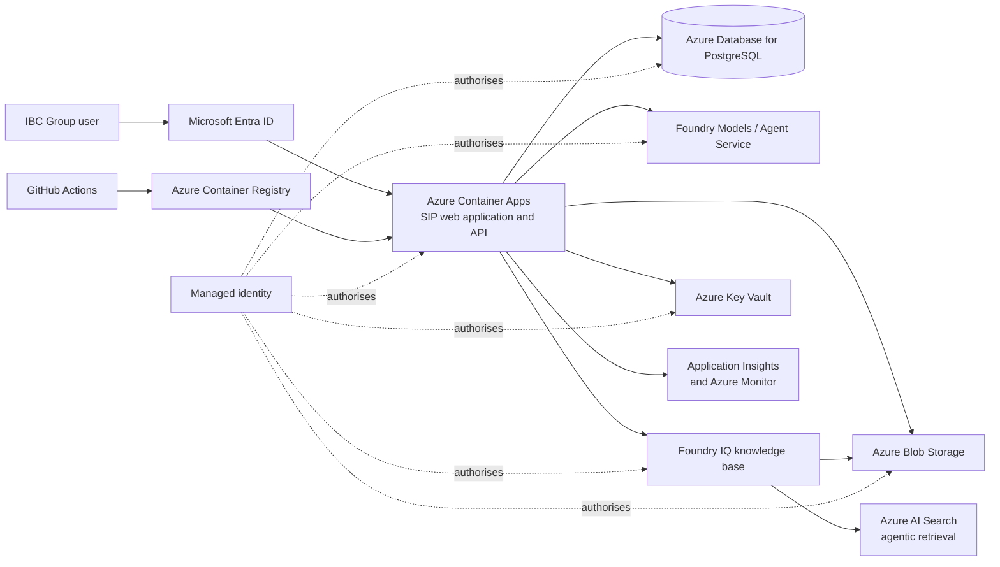

# SIP Azure target architecture and migration plan

Status: target direction  
Last updated: 21 September 2026

## Decision summary

SIP will move from Railway to Azure in controlled steps. The first Azure release
keeps the existing Python/FastAPI application so hosting, identity, data and
retrieval can be migrated without also rewriting the product.

The target knowledge layer is Microsoft Foundry IQ. The local lexical/vector index
is temporary POC code and will be removed after the Foundry IQ knowledge base has
passed the retrieval evaluation.

C#/.NET remains a valid target for stable business capabilities, but SIP will not
start with a full rewrite. Components move only when the replacement has a clear
owner, a stable contract and automated tests.

Use [AZURE_MINIMUM_RESOURCES.md](AZURE_MINIMUM_RESOURCES.md) as the short checklist
for the technical review before provisioning starts.

## Target architecture



### Service mapping

| Current POC component | Azure target | Notes |
|---|---|---|
| Railway container | Azure Container Apps | Reuse the current Docker image first. |
| Railway volume and SQLite | Azure Database for PostgreSQL Flexible Server | PostgreSQL works from Python and .NET and avoids coupling the migration to a C# rewrite. |
| `/data/uploads` | Azure Blob Storage | Separate private workspace documents from approved organisational knowledge. |
| `vectors.bin`, custom RRF and lexical fallback | Foundry IQ knowledge base backed by Azure AI Search | Remove only after retrieval quality and access control have been validated. |
| Application passwords and demo sessions | Microsoft Entra ID authentication | Use Entra users and app roles; do not migrate demo passwords. |
| Foundry/API secrets in environment variables | Managed identity and Azure Key Vault | Prefer identity-based connections; retain secrets only where a service has no identity support. |
| Railway logs | Application Insights, Log Analytics and Azure Monitor | Include request correlation, model calls, retrieval diagnostics and security-relevant events without logging sensitive prompt content by default. |
| CLI deployments | GitHub Actions and Azure Container Registry | Build immutable images tagged with the commit SHA and deploy revisions. |

## Migration sequence

Each phase must leave the application working. Do not combine phases simply to move
faster; that makes failures difficult to locate and Arrya loses visibility into the
system.

### Phase 0 — Baseline and decisions

1. Keep GitHub as the source of truth.
2. Expand automated coverage for ownership, uploads, approval, deletion and
   retrieval visibility.
3. Record the Azure subscription, tenant, target EEA region and named owners.
4. Confirm the Foundry IQ features and API versions available in that region.
5. Create a fixed multilingual retrieval evaluation set from real, non-sensitive
   SIP questions.

Exit condition: the current Railway application can be reproduced from GitHub and
its critical behaviour is covered by tests.

### Phase 1 — Azure development foundation

Provision a non-production Azure environment containing:

- Azure Container Registry;
- Azure Container Apps environment and SIP container app;
- system-assigned managed identity;
- Azure Key Vault;
- Log Analytics workspace and Application Insights;
- an Azure Blob Storage account;
- Azure Database for PostgreSQL Flexible Server;
- Microsoft Foundry and Azure AI Search resources required by Foundry IQ.

Deploy the existing Docker image to Container Apps using GitHub Actions. At this
stage Railway remains the demonstration environment; Azure is a separate development
environment with synthetic data.

Exit condition: the current application runs in Azure and can be deployed from one
reviewed GitHub commit without manually copying secrets.

### Phase 2 — Identity and application state

1. Configure Microsoft Entra ID authentication for the Container App.
2. Map Entra identity and app roles to SIP roles instead of trusting editable email
   addresses.
3. Replace SQLite persistence with PostgreSQL behind the existing store contract.
4. Move uploaded files to Blob Storage and keep metadata in PostgreSQL.
5. Add database migrations, backup policy and a tested restore procedure.
6. Remove runtime dependence on a writable local filesystem.

Exit condition: users, conversations, contexts and uploads survive container
replacement, and private content remains inaccessible to other users.

### Phase 3 — Foundry IQ knowledge migration

1. Create the Foundry IQ knowledge base and its approved knowledge sources.
2. Ingest the reviewed website corpus from Blob Storage while preserving source,
   language, organisation, page type, canonical URL and provenance.
3. Design private-versus-organisation-wide access before ingesting user documents.
4. Connect SIP through the existing retrieval boundary and map citations back to
   the current API response shape.
5. Run the same multilingual evaluation set against local retrieval and Foundry IQ.
6. Switch the Azure development environment only after relevance, citations,
   permissions, latency and cost meet the agreed thresholds.
7. Remove the local vector file, custom RRF and direct corpus embedding lifecycle
   after the cutover is accepted.

Exit condition: Foundry IQ is the only production knowledge layer and no private
document can appear in another user's retrieval results.

### Phase 4 — Production readiness and cutover

1. Confirm data residency and update the DPA/subprocessor documentation.
2. Apply least-privilege RBAC and network restrictions appropriate to the agreed
   risk level.
3. Configure alerts for failed requests, authentication failures, dependency
   failures, unusual latency and capacity.
4. Validate deletion, backup, restore, incident response and rollback.
5. Run user acceptance testing with IBC Group stakeholders.
6. Migrate approved data, freeze Railway writes, perform the final delta migration
   and switch the production URL.
7. Keep Railway read-only for a short rollback window, then remove its data and
   credentials according to the retention agreement.

Exit condition: Azure is the verified system of record and Railway can be retired.

## C#/.NET strategy

### Recommendation

Do not rewrite the complete application before the Azure migration. First replace
the infrastructure dependencies while FastAPI still behaves as the reference
implementation. After that, use a strangler migration: move one stable capability
at a time behind the same HTTP and data contracts.

### Good candidates for C#

- Microsoft Entra authentication and role-based authorisation;
- users, workspaces, conversations and portfolio APIs;
- Business Context approval and lifecycle rules;
- PostgreSQL persistence and migrations;
- audit events, operational APIs and enterprise integrations;
- Foundry Models and Foundry IQ orchestration once their request/response contracts
  are proven in the Python implementation.

These areas are stable business and platform capabilities that fit the existing
.NET expertise in the team.

### Keep in Python where it adds value

- experiments, evaluations and retrieval-quality analysis;
- website ingestion or one-off data preparation;
- AI prototypes whose contracts are still changing;
- specialised document or data-processing jobs where the Python ecosystem is the
  practical choice.

Python components should be isolated jobs or services with explicit inputs and
outputs. Do not split the application into microservices merely to use two
languages.

### What should not be ported

Do not port `retrieval.py`, `embedding.py` or the local vector-file lifecycle to
C#. Foundry IQ replaces that implementation. Rewriting temporary code creates work
without moving SIP closer to production.

### Frontend choice

The current JavaScript frontend can remain while the backend moves. Blazor is an
option if the .NET team explicitly accepts long-term ownership of the frontend; it
is not required for Azure or Foundry IQ. If selected, migrate one workflow at a
time and keep the existing API contract until the replacement is verified.

## Proposed repository shape during transition

Do not create these projects until a migration phase actually starts.

```text
backend/                 current FastAPI reference implementation
dotnet/                  future ASP.NET Core solution, when approved
  Sip.Api/               HTTP API and application composition
  Sip.Application/       use cases and business rules
  Sip.Infrastructure/    PostgreSQL, Blob, Foundry and Azure adapters
  Sip.Tests/             contract and business-rule tests
workers/                 optional Python jobs only when a real job exists
infra/                   Bicep for Azure resources
```

## Decisions still required

| Decision | Recommended default | Owner |
|---|---|---|
| Azure region | One approved EEA region shared by application, data, Search and Foundry where available | ETIL / IBC security |
| Production language | Python first; migrate stable capabilities to C# only with team ownership | Thomas and engineering team |
| Frontend | Keep current frontend until the backend and identity migration are stable | Product Owner and .NET team |
| Foundry IQ reasoning effort | Begin with minimal/low and select using evaluations, latency and cost | AI engineering |
| Private document model | Private by owner; explicit approval before organisation-wide retrieval | Product Owner / security |
| Database | PostgreSQL unless an existing enterprise standard requires Azure SQL | Engineering team |
| Infrastructure as code | Bicep stored and reviewed in this repository | Engineering team |

## Non-negotiable production checks

- No demo passwords or shared accounts.
- No application data stored only on container disk.
- No secrets committed to Git or copied manually into deployments.
- No knowledge source is organisation-wide without explicit approval.
- No model prompts, uploaded content or responses are logged by default in full.
- Backups and restore procedures are tested, not only enabled.
- Every deployment is traceable to a Git commit and can be rolled back.
- Foundry IQ retrieval passes the multilingual evaluation before the local index is
  removed.

## Microsoft reference documentation

- [What is Foundry IQ?](https://learn.microsoft.com/en-us/azure/foundry/agents/concepts/what-is-foundry-iq)
- [Foundry IQ FAQ](https://learn.microsoft.com/en-us/azure/foundry/agents/concepts/foundry-iq-faq)
- [Authentication and authorization in Azure Container Apps](https://learn.microsoft.com/en-us/azure/container-apps/authentication)
- [Managed identities in Azure Container Apps](https://learn.microsoft.com/en-us/azure/container-apps/managed-identity)
- [Security overview for Azure Container Apps](https://learn.microsoft.com/en-us/azure/container-apps/security)
- [Managed identity with Azure Database for PostgreSQL](https://learn.microsoft.com/en-us/azure/postgresql/security/security-connect-with-managed-identity)
- [Deploy Container Apps with GitHub Actions](https://learn.microsoft.com/en-us/azure/container-apps/github-actions)
- [Secure a Blazor Web App with Microsoft Entra ID](https://learn.microsoft.com/en-us/aspnet/core/blazor/security/blazor-web-app-with-entra)
